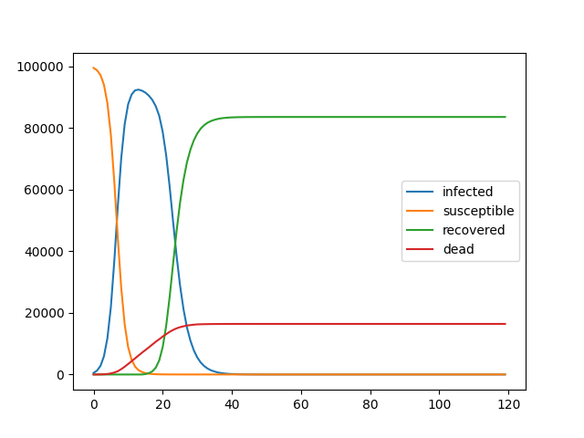
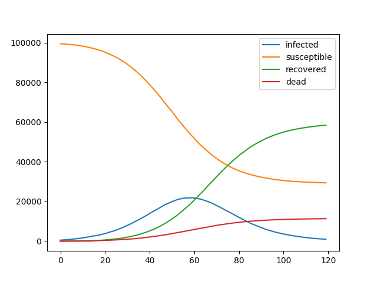

# infection_simulation

Have a lot of time to play around with Python? I do. I'm trying to play around
by building some infection simulations that I can eventually fit to actual data.

## Data Structures
The three main data structures are as follows:
- Person
- Population
- Network
- Simulation
  - Simulation(): base class for simulations
  - NetworkSimulation(): inherits Simulation, simulates static networks
  - TODO(alexanderogle): TemporalNetworkSimulation(): simulates temporally variant networks

A Person instance has a unique identifier (currently just an int) and a state.
A Person can have a state of "susceptible", "infected", "recovered", or "dead".

A Population object consists of a collection of Person objects. The Population
object has built in functions/methods for keeping track of and managing the
state of its Person objects.

A Network object generates a connections list for a population and allows networks
to be exported and imported as CSVs. You can thus generate a large and densely
connected network once and then use it repeatedly for future simulations.

A Simulation object manages the set up and tracks the evolution of state for a
Population object (whether structured via a Network object or not) over a specified time.

## Simulation Process Abstractly:
The process for running the simulation (done in model.py) currently goes like this:
1. Create a Population object with a set of Person objects that are not infected.
2. Generate a Network object for the Population, optionally saving the Network
object as a CSV.
2. Setup the Simulation with user defined initial conditions and run it.
Define what kind of simulation to run here (currently just NetworkSimulation,
but will include TemporalNetworkSimulation in the future).
3. Plot and examine the results.

## To Run Simulation:
1. Edit 'model.py' as desired
2. Run $ python3 model.py

Required dependencies:
- pandas (install with 'pip3 pandas' on Mac OSX)
- numpy
- matplotlib
- random

## Comparing to Naturalistic Data:
For a comparison to your simulation, run data_fitting.py, which pulls the latest
COVID-19 full dataset from https://ourworldindata.org/coronavirus-source-data and plots it.

## Example Output
Here's an example which had people with connections ranging from 1 - 50 other people.
Notice the narrow bell shape of the infection line.

And here is the output when social distancing is implemented (connections were more limited
ranging from 1 - 8 other people). This is "flattening the curve".

## Future Directions
There are many ways to model the dynamics of a system's change of state, and
hopefully in the future, we will bring in differential equations and some Monte
Carlo simulation.

Articles for further consideration:

  Monte Carlo Simulation - https://towardsdatascience.com/infection-modeling-part-1-87e74645568a

  Mathematical models to characterize early epidemic growth: A Review - https://www.ncbi.nlm.nih.gov/pmc/articles/PMC5348083/

  A Network-Based Compartmental Model For The Spread Of Whooping Cough In Nebraska - https://www.ncbi.nlm.nih.gov/pmc/articles/PMC6568137/
